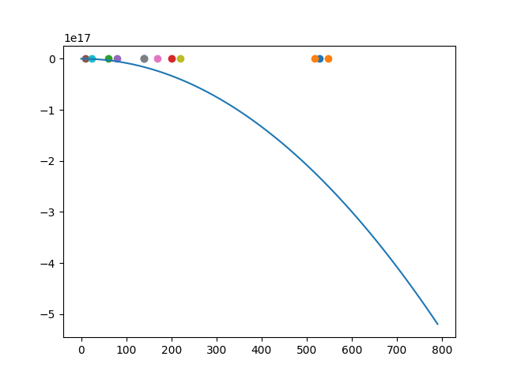
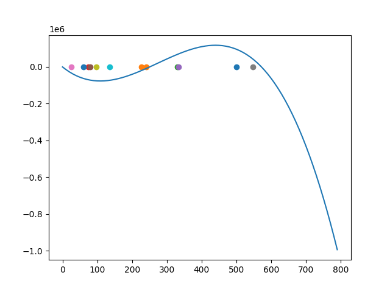

## Artificial Intelligence Lec 04
### the source of bias and variance

How to take the average of the function in different times?

As the dimension went up, the bias will go up while the variance will go down.
What we gonna do is to find a balance between the bias and the variance.

What to do with the large bias?
* **Underfitting** : cannot fit the training data.
* **Overfitting** : fit the training data but can't fit the testing data.
* **Solving the problem** : 
the first way to do with overfitting is to add the datacount, more data will adjust the loss automatically,which helps to decrease the chance of overfitting.
Some good idea to do data augmentation is to augment data automatically, by using the calculation method, sim method, etc.
Another way is to constrain the dimensions to alleviate the parameters or sharing parameters.

### Regularization
the loss function can be defined by
$$
L = \sum_{n} (\hat{y}^n - f(x,w_i))^2 + \lambda \sum (w_i)^2
$$
正则化有利于产生更小的w，使函数的值更趋向稳定

### N-fold cross validation
Separate the data set into three different parts.
Every time choose two of them as training set and another as the testing data.
Use the same model to train the model in round then calculate the bias on average.

# Lec 05 Gradient descent
When you meet saddle point or local minima.... That's bad for Gradient descent.

### Tayler Series Approxi.
$$
L(\theta) = L(\theta') + (\theta - \theta)^Tg + 1/2(\theta - \theta)^TH(\theta - \theta') 
$$
$g$ means the gradient, and $H$ is a matrix hessian can be useful

the $1/2(\theta - \theta)^TH(\theta - \theta')$ can tell us where we are: local max, local min, or saddle point.

when $v^T H v >0$, it's a local minima, and when it's $<0$, it's a local maxima.

So let's use some linear algebra. $H$ is positive definite(all eigenvalue is positive), then we can determine the point is the local minima and vice versa.

#### An example
we use the model $y = w_1w_2 x$, we can simply take all value of $w_1s \ and \ w_2s$ to find the least Loss.

So, we have the loss function:
$$
L = (\hat{y} -w_1w_2x)^2
$$
And then, we calculate the partial derivative:
$$
\frac{\partial L}{\partial w_1}
$$
After that, we could calculate the Hessian matrix:
$$
\begin{matrix}
\frac{\partial L^2}{\partial ^2 w_1} & \frac{\partial L^2}{\partial  w_1 \partial w_2} \\
\frac{\partial L^2}{\partial  w_1 \partial w_2} & \frac{\partial L^2}{\partial^2w_2}
\end{matrix}
$$
We can get the eigenvalue of the matrix, and we can determine where we are, for example:
We get the eigenvalue ${2, -2}$, so now we are in the saddle point.
The next step is to move towards the eigenvector, which is pointed to the smaller value.

Another problem is the local minima. Actually, as the dimension gets higher, the local minima can be converted to the saddle point.

"We are just 3-Dimensional species, but when it comes higher, we may find a new world."

Every time we train the model, we determine the minimum ratio, namely the ratio of number of positive eigen values ans number of eigen values.
